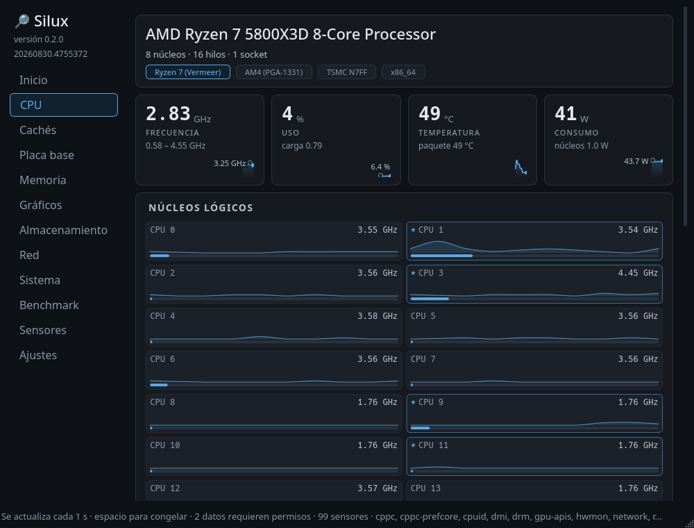
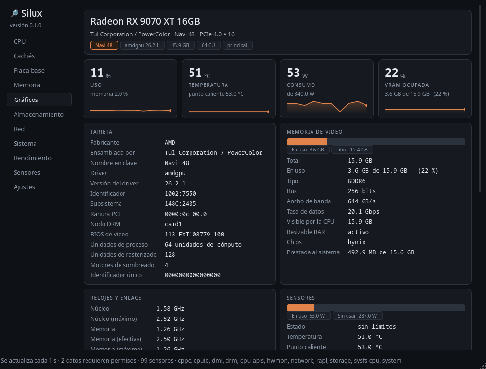
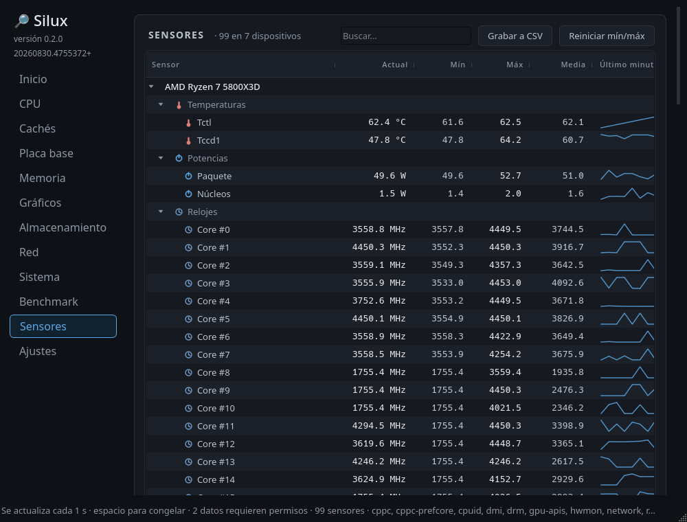
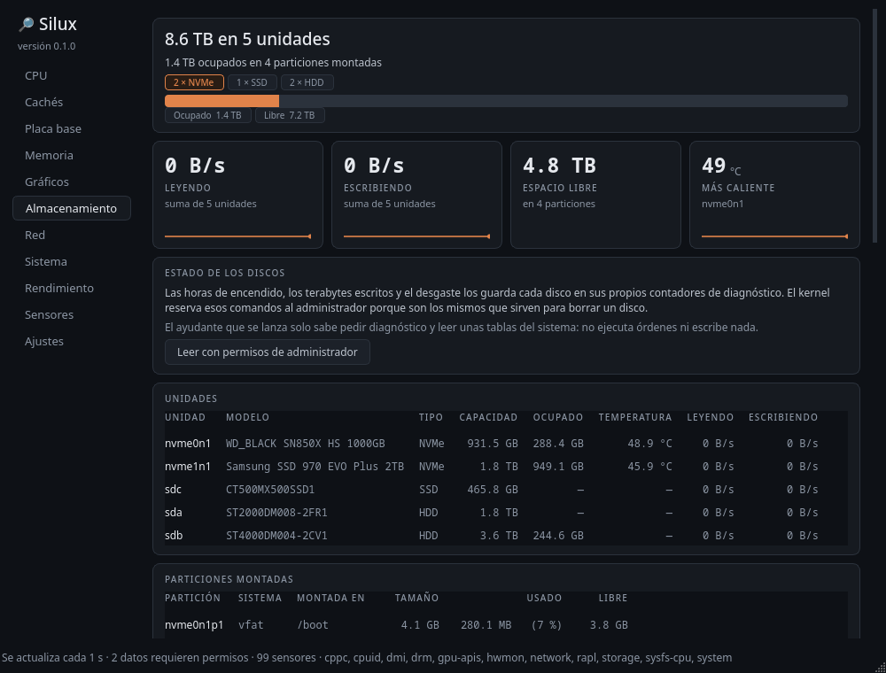
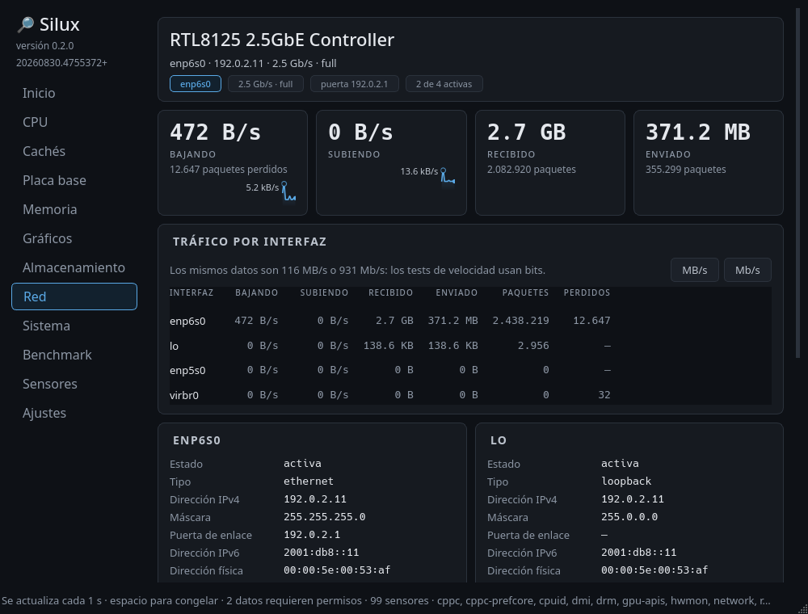

# Silux

[](https://github.com/rcv11x/silux/actions/workflows/appimage.yml)

**Perfilador de hardware para Linux.** Lo que en Windows hacen CPU-Z, GPU-Z y
HWMonitor, en un solo programa nativo: qué equipo tienes y qué está haciendo
ahora mismo.

Escrito en Python puro, sin más dependencia que Qt para la ventana.

Estado: las trece secciones terminadas. Inicio, CPU, Cachés, Placa base,
Memoria, Gráficos, Almacenamiento, Red, Batería, Sistema, Rendimiento,
Sensores y Ajustes. La de Batería solo aparece en los equipos que tienen una.

Versión actual: **0.2.0** · qué trae y qué cambia al actualizar, en
**[CHANGELOG.md](CHANGELOG.md)**.

Escrito con ayuda de Claude.



<p align="center">
  
  
  
  
</p>

## Qué es y qué no

Dos preguntas, y solo dos:

- **Qué hardware es este.** Procesador, cachés, placa base, memoria, gráfica.
  Es el terreno de CPU-Z, y en Linux está mal cubierto.
- **Qué está haciendo ahora.** Todos los sensores del equipo con sus mínimos,
  máximos y medias. Es el terreno de HWMonitor y HWiNFO64, y en Linux está
  peor cubierto todavía.

Las dos son la misma pregunta sobre el mismo hardware, leyendo las mismas
fuentes, y por eso viven en el mismo programa: HWiNFO64 lleva años
demostrándolo.

**Lo que este programa no es: un administrador de tareas.** Los procesos son
software, no hardware; se leen de otro sitio, se presentan de otra forma y
(a diferencia de todo lo que hay aquí) exigen actuar sobre el sistema y no
solo leerlo. Además Linux ya tiene buenos administradores de tareas. El hueco
está en el otro lado.

```bash
python3 -m silux.ui.app                 # interfaz gráfica
python3 -m silux.cli --sensors          # solo el árbol de sensores
python3 -m silux.ui.app --compact       # densidad compacta
python3 -m silux.ui.app --size 700x520  # tamaño concreto para esta ejecución
python3 -m silux.cli                    # volcado en el terminal
python3 -m silux.cli --json             # el mismo dato, para otros programas
python3 -m silux.cli --watch            # refresco continuo en texto
python3 -m silux.cli --report i.md      # informe para adjuntar a un fallo
python3 -m silux.ui.app --anonimo       # oculta lo que identifica al equipo
```

`--anonimo` cambia el nombre del equipo, las direcciones y los números de
serie por otros de la misma pinta. Las capturas de aquí arriba están hechas
así: el hardware es real y lo que señala a una máquina concreta, no.

La ventana abre a 900×680 y recuerda el tamaño al cerrarla. El suelo depende
de la densidad (470×400 en normal, 400×340 en compacta) y no es el mínimo
técnico, que ronda los 270 px: es el punto por debajo del cual los nombres de
campo se recortan tanto que dejan de identificar nada.

Para llegar hasta ahí sin romperse: las filas de tarjetas se reparten en
menos columnas, los textos largos se recortan con puntos suspensivos (el
completo queda en el tooltip), la tabla de cachés se desplaza dentro de su
propia tarjeta, y por debajo de 620 px la barra lateral se cambia por un
selector compacto en la barra de estado.

## Probarlo

### AppImage

Un solo archivo, sin instalar nada:

```bash
chmod +x silux-x86_64.AppImage
./silux-x86_64.AppImage
```

Lleva dentro Python, Qt y las bibliotecas que necesita. Ocupa 51 MB, que es lo
que queda después de podar: de PySide6 solo van QtCore, QtGui y QtWidgets (los
otros treinta módulos sobran) y se dejan fuera la integración con el tema del
escritorio (arrastra GTK y los iconos de Breeze, 40 MB, y el programa fija el
estilo Fusion de todas formas) y los formatos de imagen que tiran de los
códecs de video del sistema. Sin esa poda serían 561 MB.

Se construye con:

```bash
python3 tools/build_appimage.py              # con lo que haya en esta máquina
python3 tools/build_appimage.py --container  # en Ubuntu 22.04, para repartirlo
```

### Compatibilidad

Un AppImage se lleva dentro los binarios del sistema donde se construyó, **con
sus exigencias**, y hay dos que dejan fuera a mucha gente sin avisar:

**El nivel de instrucciones.** Algunas distribuciones compilan para
`x86-64-v3`, que pide AVX2 y compañía: procesadores de 2013 en adelante.
CachyOS lo hace por omisión. En una CPU anterior el sistema se niega a arrancar
con un escueto `CPU ISA level is lower than required`, que no dice de quién es
la culpa.

**La versión de glibc.** Lo compilado contra una glibc nueva no arranca en un
sistema con una más vieja, aunque al revés sí funcione.

Las dos se resuelven igual: construyendo dentro de una distribución antigua y
genérica, que es lo que hace `--container` y lo que hace la acción de GitHub en
cada versión publicada. El script avisa al terminar de a quién está dejando
fuera lo que acaba de construir.

### Desde el código

Hace falta Python 3.10 o superior y PySide6. La base de datos de CPU y los
nombres de dispositivos vienen del paquete `hwdata`, que ya está en casi
cualquier distribución.

```bash
# Arch, CachyOS, Manjaro
sudo pacman -S --needed python-pyside6 hwdata polkit

# Fedora
sudo dnf install python3-pyside6 hwdata polkit

# Debian, Ubuntu
sudo apt install python3-pyside6 hwdata policykit-1

git clone https://github.com/rcv11x/silux
cd silux
python3 -m silux.ui.app
```

Sin PySide6 el volcado en terminal (`python3 -m silux.cli`) funciona igual: la
interfaz es lo único que lo necesita.

## Qué se lee y de dónde

| Dato | Fuente | ¿Permisos? |
| --- | --- | --- |
| Fabricante, marca, familia, modelo, stepping | `CPUID` en espacio de usuario | no |
| Juego de instrucciones | `CPUID` hojas 1, 7, 0x80000001 | no |
| Nombre en clave, nodo de fabricación | `CPUID` + base de datos | no |
| Encapsulado (socket) | base de datos por microarquitectura | no |
| BCLK, reloj base, techo de turbo del silicio | `CPUID` hoja 0x16 | no |
| Núcleos, hilos, topología, núcleos P/E | `/sys/devices/system/cpu/*/topology` | no |
| Jerarquía de caché | `/sys/devices/system/cpu/*/cache` | no |
| Frecuencias, driver, gobernador, turbo | `cpufreq`, `intel_pstate` | no |
| Preferencia de energía (EPP) | `cpufreq` | no |
| Virtualización, si se corre dentro de una VM y en cuál | `CPUID` hojas 1 y 0x40000000 | no |
| Carga media a 1, 5 y 15 minutos | `/proc/loadavg` | no |
| Distribución, kernel, escritorio, sesión | `/etc/os-release`, `uname` | no |
| Memoria, intercambio, procesos, hilos | `/proc/meminfo`, `/proc/loadavg` | no |
| Uso total y por núcleo | `/proc/stat` | no |
| Temperaturas | `hwmon` (coretemp, k10temp…) | no |
| Consumo en vatios, por dominio | `powercap` / RAPL | según distribución |
| Límites de potencia PL1 y PL2 | `powercap` / RAPL | no |
| Voltaje del núcleo | Super I/O por `hwmon`, o MSR | driver o root |
| Todos los sensores del equipo | `hwmon` y `power_supply` | no |
| Placa, BIOS, versión y fecha del firmware | `/sys/class/dmi/id` | no |
| Módulos de RAM: fabricante, chips, referencia, fecha | SPD por SMBus | no |
| Velocidad catalogada y temporizaciones JEDEC/XMP | SPD por SMBus | no |
| UEFI o BIOS heredada, arranque seguro, TPM | `/sys/firmware`, `/sys/class/tpm` | no |
| Chipset y controlador de memoria | bus PCI + `pci.ids` | no |
| Umbrales de alarma de cada sensor | `hwmon` (`*_max`, `*_crit`) | no |
| Gráfica: identidad, VRAM, tabla DPM, enlace PCIe | nodo DRM en `/sys/class/drm` | no |
| Tipo de VRAM, anchura del bus, unidades de cómputo | ioctl `AMDGPU_INFO` | no |
| Versiones de OpenGL, Vulkan y OpenCL | las bibliotecas, en otro proceso | no |
| Monitor: modelo, tamaño, resolución y refresco | EDID del conector | no |
| Por qué se frena la gráfica AMD | `gpu_metrics` del firmware | no |
| Gráficas NVIDIA con el driver propietario | NVML | no |
| Discos: modelo, tipo, enlace, particiones | `/sys/block`, `/proc/mounts` | no |
| Horas de encendido, terabytes escritos, desgaste | SMART por `ioctl` (NVMe y SATA) | sí |
| Interfaces de red, direcciones y tráfico | `/sys/class/net`, `/proc/net/dev` | no |

Cuando algo no se puede leer, la aplicación **lo dice y explica por qué** en
lugar de dejar el campo vacío o esconder la sección.

## Tests

```bash
QT_QPA_PLATFORM=offscreen python3 -m unittest discover -s tests -t .
python3 tools/comprobar_privacidad.py    # antes de publicar nada
python3 tools/probar_en_minimo.py --container   # en el Python 3.10 del suelo
```

La última hace falta porque pasar en el Python de uno no dice nada del mínimo
que declara el proyecto: corre la suite dentro de una Ubuntu 22.04, que es la
misma en la que corre el CI y en la que se construye el AppImage.

Son 1438 y tardan cerca de dos minutos. Ninguno necesita hardware concreto:
los proveedores se prueban contra árboles de sysfs sintéticos, el generador
contra fragmentos de C, y los chips (SPD, EDID, SMART, `gpu_metrics`) contra
volcados binarios de piezas reales guardados en `tests/fixtures`.

Buena parte de ellos existe porque algo salió mal una vez: hay un test que
comprueba que a un procesador ARM no se le atribuye una instrucción de Intel,
y otro que vigila que las unidades de cómputo de una gráfica no acaben en la
ficha de la de al lado.

## Si algo no sale bien

```bash
python3 -m silux.cli --report informe.md
```

O el botón **Guardar informe del equipo…** en Ajustes. Genera un archivo con el
hardware detectado y, sobre todo, con lo que **no** se ha podido leer y por
qué: qué fuentes respondieron, qué módulos del kernel faltan y qué datos no
están disponibles. Es lo que hay que adjuntar al abrir un issue.

El informe **omite el nombre del equipo, las direcciones IP y MAC, los números
de serie y las rutas de las particiones**, porque está pensado para pegarlo en
un sitio público. Con `--with-identifiers` se incluyen, si hacen falta para el
caso.

Desde el AppImage es `./silux-x86_64.AppImage --report informe.md`, que saca lo
mismo. Y conviene dar antes los permisos, con el botón que sale dentro del
propio aviso en Memoria, Gráficos o Almacenamiento: sin ellos, el módulo de
memoria
y el diagnóstico de los discos salen como «requiere permisos» en vez de salir.

Si lo que se ve mal es la ventana (texto cortado, columnas montadas, un color
que no se lee), eso no sale en el informe y hace falta una captura.

Lo que más falta por probar, porque aquí no hay hardware para ello: una AMD con
dos CCD (7950X3D y parecidos), cualquier NVIDIA con el driver propietario, un
Intel híbrido con núcleos P y E, y una APU con gráficos integrados.

## El idioma de la interfaz

**Español neutro**, no de España. La diferencia son cuatro palabras y se
resuelven así:

| En vez de | Se escribe |
| --- | --- |
| vídeo | video |
| fichero | archivo |
| aparato | dispositivo |
| ordenador | equipo |

El motivo es de alcance: nueve de cada diez hispanohablantes están al otro lado
del Atlántico, y «BIOS de vídeo» o «ficheros abiertos» les suenan a traducción
ajena. Neutro no significa insípido (el resto del texto mantiene su voz) sino
no cerrarle la puerta a nadie por una tilde.

Los comentarios del código van en el español del autor y no siguen esta regla:
no los ve el usuario, no se traducen y no hay razón para uniformarlos.

## Licencia

GPL-3.0 o posterior. El texto completo está en [LICENSE](LICENSE).

Es la GPL y no una licencia permisiva porque la base de datos de identificación
que se distribuye incluye la tabla de encapsulados heredada de CPU-X, que es
GPL-3.0.

### Fuentes de datos

- [libcpuid](https://github.com/anrieff/libcpuid) · BSD 2 cláusulas · tablas de identificación
- [CPU-X](https://github.com/TheTumultuousUnicornOfDarkness/CPU-X) · GPL-3.0 · tabla de sockets
- `pci.ids` y `pnp.ids` del sistema (paquete hwdata) · nombres de dispositivos y de monitores

## Cómo funciona por dentro

Por qué el modelo guarda números y no texto, de dónde sale cada dato, cómo se
lee el chip SPD de la memoria o el EDID del monitor, qué hace el ayudante
privilegiado y qué se intentó antes que no salió bien:

**[docs/como-funciona.md](docs/como-funciona.md)**

Y para quien vaya a tocar el código, [CLAUDE.md](CLAUDE.md): las reglas que
sostienen el diseño, con el problema concreto del que salió cada una, y la
lista de lo que ya se intentó y no funcionó. Se llama así porque el proyecto
se escribió con ayuda de Claude y es el archivo que lee al abrirlo, pero lo
que hay dentro no va dirigido a una herramienta: es por qué el código está
hecho como está.
